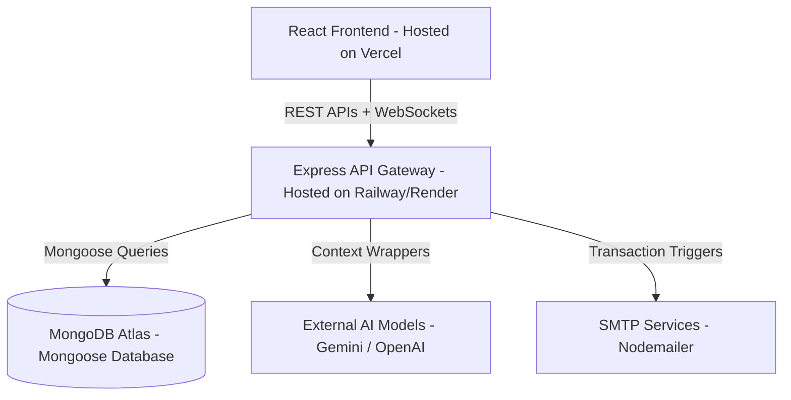

# System Architecture Guide - CareerSaathi

This guide maps out the structural engineering, component boundaries, and data synchronization patterns of the **CareerSaathi** platform.

---

## 1. Architectural Blueprint Overview

CareerSaathi uses a decoupled **Client-Server Architecture** designed for low latencies, modular operations, and horizontal scalability.

### Key Framework Components:
1. **Frontend Layer**: A React Single Page Application (SPA) powered by Vite. Global routing is managed dynamically, with Tailwind CSS rendering visual layouts.
2. **Backend Services Gateway**: An Express API router managing request throttling (Rate Limiter), helmet header hardening, and JWT-driven Role-Based Authorization Gates.
3. **AI Pipeline Broker**: Wrappers coordinating prompts to Gemini API or OpenAI API, parsing JSON structures, and gracefully switching to heuristic local fallbacks if API limits are saturated.

---

## 2. Entity-Relationship Data Model (Mongoose)

### Conceptual Schema definitions:
- **User**: Base model holding authorization credentials, email verification flags, and operational role tags (`student`, `mentor`, `admin`, `superadmin`).
- **Student Profile**: Holds student's dynamic interest catalogs, technical skills lists, historical academic grades, and higher education budgets.
- **Mentor Directory**: Stores professional designations, verified company names, consultation session fee quotes, ratings, and weekday availability timeslots.
- **Bookings Ledger**: Tracks mentorship schedule slots, payment validation status (`pending`, `paid`), and dynamic video stream meeting references (Jitsi integration).
- **Scholarship Directory**: Stores deadline schedules, qualification matrices, amount allocations, and external application linkages.
- **Career Reports**: Cache records mapping AI-generated timelines, recommended job descriptions, and course requirements to reduce LLM token overheads.
- **ATS Resumes**: Stores resume grading results, keywords found, missing keyword sets, and structural improvement hints.
- **Mock Interviews**: Timeline registry storing interview Q&A history, pacing metrics, clarity feedback, and overall ratings.

---

## 3. Communication Patterns

- **REST APIs**: Used for resource CRUD (Retrieving scholarships, registering, launching predictions).
- **WebSockets (Socket.io)**: Integrates real-time messaging updates between students and mentors during consultations.
- **SMTP**: Direct transaction notifications (OTP triggers, booking confirmations) using Nodemailer.
